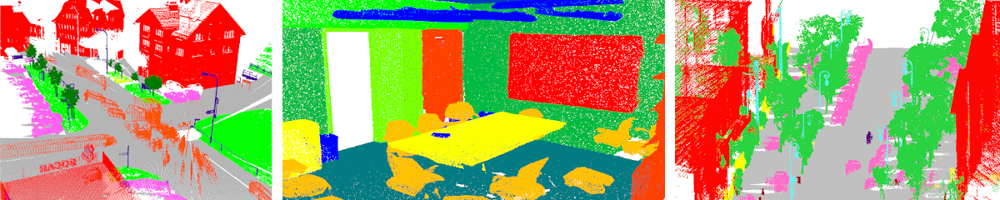

# [LightConvPoint](https://arxiv.org/abs/2004.04462)

A framework to build convolutional network for point cloud processing.



## Paper: FKAConv, Feature-Kernel Alignment for Point Cloud Convolution

LightConvPoint is the framework developped and used for FKAConv experiments.
The paper is available at arxiv: [https://arxiv.org/abs/2004.04462](https://arxiv.org/abs/2004.04462)

If you use the FKAConv code or the LightConvPoint framework in your research, please consider citing:

```
@inproceedings{boulch2020fka,
  title={{FKAConv: Feature-Kernel Alignment for Point Cloud Convolution}},
  author={Boulch, Alexandre and Puy, Gilles and Marlet, Renaud},
  booktitle={15th Asian Conference on Computer Vision (ACCV 2020)},
  year={2020}
}
```


## Ressources

* [Installation](doc/install.md): install and setup lightconvpoint
* [Run experients](examples/README.md): re-run experiments from the paper
* [Getting started](doc/getting_started.md): start to design your own network
* [Library features and implemented algorithms](doc/features.md): description of avalailable algorithms in LCP (convolutional layers such as LightConvPoint or ConvPoint; support point selection including quantized search or farthest point sampling).

### Example

We provide examples classification and segmentation datasets:
* ModelNet40
* ShapeNet
* S3DIS
* Semantic8
* NPM3D

